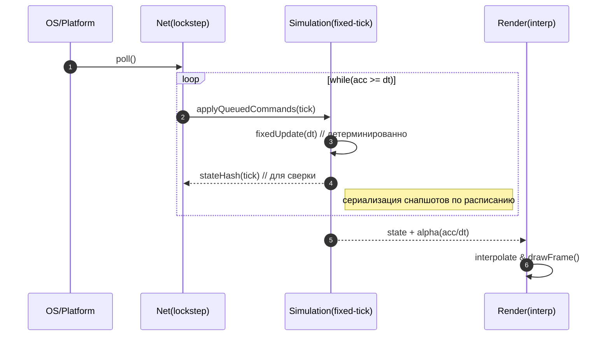
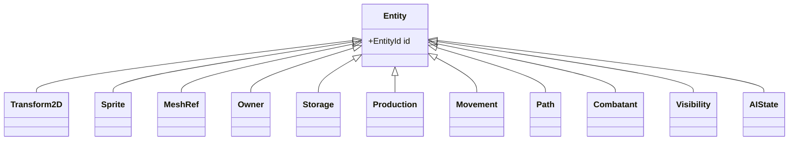

# Equilibrium Engine — Архитектура (v0.1)

> **Контекст.** Equilibrium — игровой движок для глобальной стратегии в реальном времени. Основная сцена — 2D-плоскость с поддержкой 3D-объектов (2.5D). Ключевые свойства: детерминизм симуляции, сетевой lockstep, воспроизводимые сохранения/реплеи, data-driven контент и моддинг.

---

## 1. Цели и константы

- **Детерминизм симуляции.** При идентичных входных данных состояние игры идентично на всех клиентах.
- **Lockstep-мультиплеер.** Передаются команды игроков и системные события; состояние хранится и эволюционирует локально.
- **2.5D.** Основной рендер — 2D (батчи спрайтов). Поддерживаются вставки 3D-моделей/эффектов на плоскости.
- **Data-driven.** Правила экономики/дипломатии и конфигурация ресурсов оформляются файлами и скриптами; допускается горячая перегрузка.
- **Расширяемость.** Модульная архитектура; инструменты и моддинг — полнофункциональные граждане.

---

## 2. Слои и их взаимодействие

```mermaid
graph TD
  A[Platform<br/>(OS/FS/Time/Window/Input/Net)] --> B[Core<br/>(Alloc/Jobs/Log/Profiler/Serialization)]
  B --> C[Resources<br/>(Textures/Atlases/Mesh/Audio/Fonts)]
  B --> D[Simulation<br/>(ECS/World/Economy/Logistics/AI/Combat/Diplomacy)]
  C --> E[Render<br/>(SpriteBatch/UI/SDF Text/3D Inserts/PostFx)]
  D --> E
  D --> F[Net<br/>(Lockstep/Commands/Resync/Replays/Snapshots)]
  G[Gameplay API<br/>(Events/Modifiers/Scripts)] --> D
  H[Tools/Editors<br/>(Map/Rules/Profiler/Determinism Viewer)] --> D
  H --> E
  H --> C
```

---

## 3. Главная петля и lockstep



**Параметры.** Базовый фикс-тик `dt = 1/30` или `1/60`. Команда применяется на `tick = now + inputDelay` (например, +3), чтобы нивелировать лаг.

---

## 4. Требования к детерминизму

- Числа: целые/фикс-пойнт для логики; плавающая арифметика — только во вью-слое.
- Порядок обхода: стабильный (по ID/индексу), структуры с неопределённым порядком — запрещены.
- RNG: детерминированный `rng(seed, tick, entityId)`; в скриптах доступ только к такому RNG.
- Сим-шаг: однопоточен/упорядочен; тяжёлые задачи (path/AI/поиск рынков) квотируются и распределяются по тикам.
- Отсутствие зависимости от системного времени/окружения в сим-шаге.

---

## 5. Модель мира и ECS

- Пространство: тайловая сетка (квад/гекс) + агрегирующие **регионы**; отдельный **граф логистики** (рёбра: пропускная способность/стоимость/задержка).
- Сущности: `EntityId` + набор компонентов в контейнерах **SoA**.
- Примеры компонентов: `Transform2D`, `Sprite/MeshRef`, `Owner`, `Population`, `Storage`, `Production`, `Market`, `Movement`, `Path`, `Combatant`, `Visibility`, `AIState`.
- Системы: **Economy**, **Logistics**, **Production**, **Diplomacy**, **Population**, **Navigation**, **Combat**, **Weather/Seasons** (опц.).
- Событийная модель: `OnTick`, `OnTradeRouteBroken`, `OnTreatySigned`, `OnShortage`, …



---

## 6. Рендер (2.5D)

- **SpriteBatch**: сортировка по `(material, atlas, layer)`, инстансинг.
- **3D-вставки**: ограниченный пайплайн мешей (1–2 шейдера, псевдо-тени/нормали).
- Пост-эффекты: тон-мап, зерно, кривые. UI — SDF-текст.
- Камера: ортографическая 2D; дополнительные проекции (в т.ч. изометрия) — как опция.

---

## 7. Сеть, реплеи, сохранения

- **Команда**: `{ playerId, tick, actionId, payload }`. Отправка на `tick + inputDelay`.
- **Сверка**: периодический хэш критичных массивов состояния; при расхождении — запрос микро-снимка и ресим.
- **Реплей**: `{ seed, snapshots, commands }`. Воспроизведение = «репро» оригинального lockstep-прогона.

---

## 8. Скрипты и моддинг

- Встраиваемый скриптовый рантайм (**Lua/Wren**). Предоставляется только детерминированный API.
- Горячая перегрузка правил экономики/дипломатии и игровых событий.
- Песочница: ограничение времени/памяти, запрет IO/clock.

---

## 9. Инструменты/редакторы

- Редактор карт (тайлы/высоты/биомы/ресурсы/дороги), редактор правил экономики/дипломатии.
- Профайлер и **Determinism Viewer** (граф тиков, хэши, точки расхождения).
- Форматы: `.eqmap`, `.eqrules`, `.eqpack` (пак ассетов), скрипты и таблицы в человекочитаемом виде.

---

## 10. Предлагаемая файловая структура

```
/engine
  /platform        # окно/ввод/время/фс/сеть
  /core            # аллокатор, jobs, лог, сериализация, профайлер
  /resource        # загрузчики, кэш, атласы, материалы
  /render          # batch2D, 3D inserts, ui/sdf, postfx
  /sim
    /ecs           # SoA контейнеры, entity registry
    /world         # grid, regions, logistics
    /systems       # economy, logistics, production, diplomacy, ai, combat
    /net           # lockstep, реплеи, снапшоты
  /scripting       # vm, api
/tools
  /map_editor
  /rules_editor
/samples
  /vertical_slice
/docs
```

---

## 11. Сводная таблица модулей и связей

| Модуль | Ответственность | Ключевые данные/типы | Взаимодействие (вход/выход) | Требования к детерминизму |
|---|---|---|---|---|
| Platform | Окно, ввод, время, сеть, ФС | таймер, сокеты, события ввода | ↑Core: time/IO; ↑Net: сокеты | Не влияет (в сим-шаг не допускается wall-clock) |
| Core | Лог, профайлер, сериализация, jobs | проф.метки, сериализатор, очереди | ↔ все слои | Нейтрально |
| Resources | Загрузка/кэш ассетов | Texture/Atlas, Mesh, Audio, Font | → Render: GPU ресурсы | Нейтрально |
| Render | Рисование 2D/3D, UI | батчи, материалы, камеры | ← Sim(state), → экран | Не критичен (float допустим) |
| Simulation | ECS, системы, мир | SoA массивы, Region/Logistics | ← NetCommands, → StateHash/Snapshots | **Строгий** (fixed-point/int, порядок) |
| Net | Lockstep, реплеи, ресинк | очередь команд, снапшоты | ↔ Simulation, ↔ Platform | **Строгий** (тайминги тиков) |
| Scripting | Игровые правила | VM, API-обёртки | ↔ Simulation (события/эффекты) | **Строгий** (дет. API) |
| Tools | Редакторы/профайлеры | форматы карт/правил | ↔ Resources/Simulation/Render | Нейтрально |

---

## 12. MVP-план (8–12 недель)

**A. Базовая жизнеспособность**
- Петля fixed-tick, локальный lockstep-каркас (без сети).
- ECS-лайт (SoA), менеджер ресурсов, SpriteBatch.

**B. Симуляция**
- Grid+Regions, движение юнитов.
- Простая экономика (2–3 ресурса, 1 цепочка), сохранения/реплеи.

**C. Сеть и вертикальный срез**
- Транспорт (UDP/ENet), подтверждения тиков, ресинк по снапшотам.
- Играбельная карта на 10–15 минут, минимальный редактор карт.

---

## 13. Мини-спецификации

**Структура команды**
```
struct Command {
  uint32 playerId;
  uint32 tick;
  uint16 actionId;   // enum
  byte   payload[];  // varints, little-endian
}
```

**Хэш состояния**
- Ежетику: хэш упорядоченного дампа критичных SoA-массивов. Логирование: `tick, hash, lastCommandId`.

---

## 14. Замечания по миграции текущего кода

- `TransformComponent`, `TextureComponent`, `PolygonEntity`, `GameObject`, `TextureManager` следует разнести по слоям **render/resource**, а логику сущностей перенести в **sim/ecs**.
- Внедрить ленивые флаги «грязности» для матриц/UV (есть в текущем коде) и развить их до SoA-контейнеров в симуляции.
- Добавить проверку детерминизма: сверка хэшей каждые N тиков и режим автотеста реплеев.
