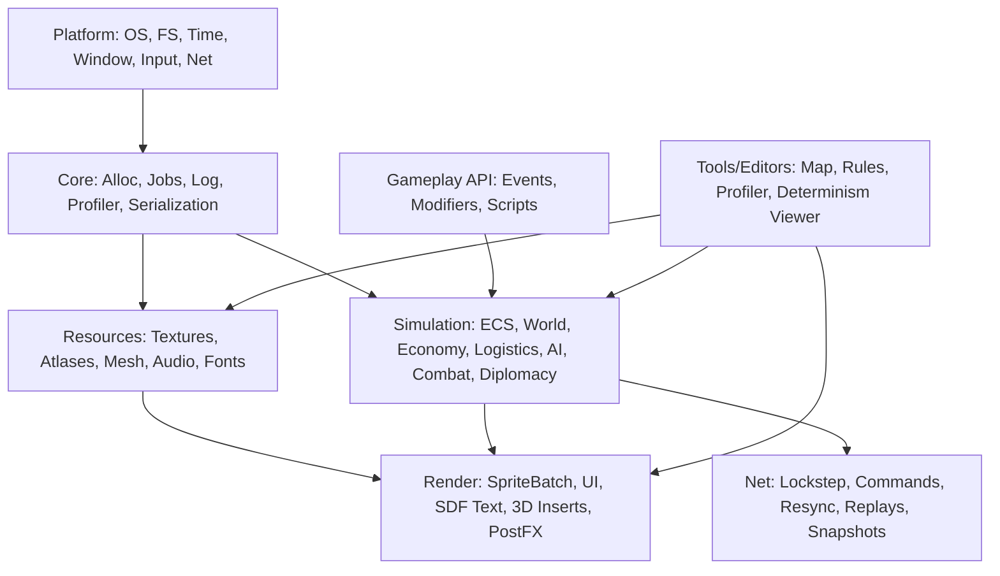
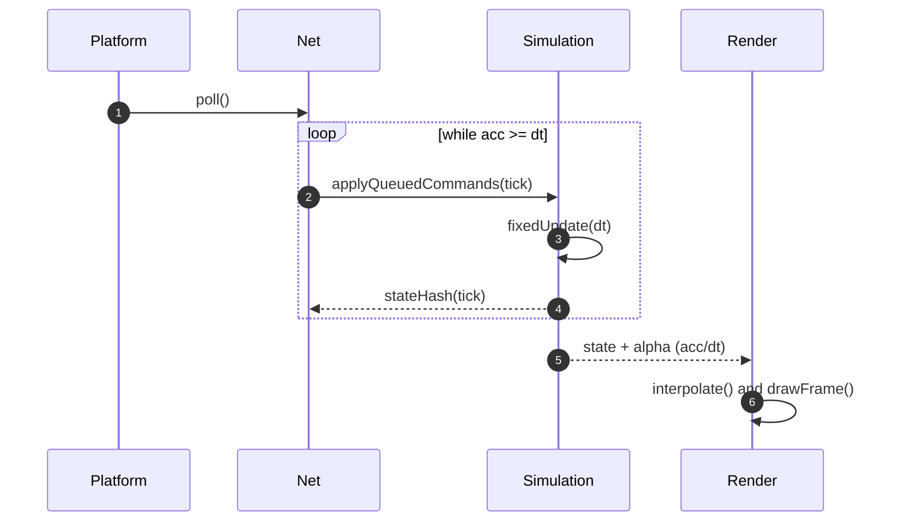
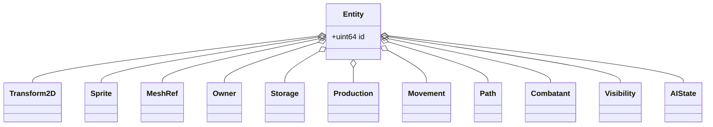

# Equilibrium Engine — Архитектура (v0.2)

**Контекст.** Equilibrium — игровой движок для глобальной стратегии в реальном времени. Базовая сцена — **2D-плоскость** с поддержкой **3D-объектов** (2.5D); изометрия не обязательна. Ключевые свойства: **детерминизм** симуляции, **lockstep**-сеть, воспроизводимые **сохранения/реплеи**, **data‑driven** контент и моддинг.

---

## 1) Цели и константы

- **Детерминизм.** При одинаковых входах все клиенты приходят к идентичному состоянию.
- **Lockstep.** Передаём только команды игроков; состояние эволюционирует локально.
- **2.5D.** Рендер 2D‑сцены с возможностью вставок 3D‑мешей/эффектов.
- **Data‑driven.** Правила экономики/дипломатии и конфигурации — во внешних данных и скриптах.
- **Расширяемость.** Модульная структура; инструменты и моддинг — полноценные граждане.

---

## 2) Обзор слоёв и взаимодействий



---

## 3) Главная петля и lockstep



**Параметры.** Фикс‑тик `dt = 1/30` или `1/60`. Команды применяются на `tick = now + inputDelay` (например, `+3`). Каждые _N_ тиков сверяем `hash(state)`; при расхождении — быстрый ресинк по снапшоту и ресимуляция.

---

## 4) Модель ECS (пример компонентов)



---

## 5) Сводная матрица модулей

| Модуль      | Ответственность                            | Ключевые данные/типы                | Взаимодействие (вход/выход)                  | Требования к детерминизму                  |
|-------------|---------------------------------------------|-------------------------------------|----------------------------------------------|--------------------------------------------|
| Platform    | Окно, ввод, время, сеть, ФС                 | таймер, сокеты, события ввода       | ↑ Core: time/IO; ↑ Net: сокеты               | Не влияет (wall‑clock в сим‑шаге — нет)    |
| Core        | Лог, профайлер, сериализация, jobs          | проф.метки, сериализатор, очереди   | ↔ все слои                                   | Нейтрально                                 |
| Resources   | Загрузка/кэш ассетов                        | Texture/Atlas, Mesh, Audio, Font    | → Render: GPU‑ресурсы                        | Нейтрально                                 |
| Render      | Рисование 2D/3D, UI                         | батчи, материалы, камеры            | ← Simulation(state), → экран                  | Не критичен (float допустим)               |
| Simulation  | ECS, системы, мир                           | SoA‑массивы, Region/Logistics       | ← NetCommands, → StateHash/Snapshots         | **Строгий** (fixed‑point/int, порядок)     |
| Net         | Lockstep, реплеи, ресинк                    | очередь команд, снапшоты            | ↔ Simulation, ↔ Platform                     | **Строгий** (тайминги тиков)               |
| Scripting   | Игровые правила (скрипты)                   | VM, API‑обёртки                     | ↔ Simulation (события/эффекты)               | **Строгий** (детерминированный API)        |
| Tools       | Редакторы/профайлеры                        | форматы карт/правил                 | ↔ Resources/Simulation/Render                | Нейтрально                                 |

---

## 6) Предлагаемая файловая структура

```
/engine
  /platform        # окно/ввод/время/фс/сеть
  /core            # аллокатор, jobs, лог, сериализация, профайлер
  /resource        # загрузчики, кэш, атласы, материалы
  /render          # batch2D, 3D inserts, ui/sdf, postfx
  /sim
    /ecs           # SoA контейнеры, entity registry
    /world         # grid, regions, logistics
    /systems       # economy, logistics, production, diplomacy, ai, combat
    /net           # lockstep, реплеи, снапшоты
  /scripting       # vm, api
/tools
  /map_editor
  /rules_editor
/samples
  /vertical_slice
/docs
```

---

## 7) MVP‑план (8–12 недель)

**A. Базовая жизнеспособность**  
Fixed‑tick петля, локальный каркас lockstep (без сети), ECS‑лайт (SoA), менеджер ресурсов, SpriteBatch.

**B. Симуляция**  
Grid+Regions, движение юнитов; простая экономика (2–3 ресурса, 1 цепочка), сохранения/реплеи.

**C. Сеть и вертикальный срез**  
Транспорт (UDP/ENet), подтверждения тиков, ресинк по снапшотам; играбельная карта на 10–15 минут, минимальный редактор карт.

---

## 8) Правила детерминизма

- Логика — целые/фикс‑пойнт; плавающие числа оставить визуалу.
- Стабильный порядок обхода (по ID/индексу); без структур с неопределённым порядком.
- RNG только из движка: `rng(seed, tick, entityId)`; в скриптах доступен лишь он.
- Сим‑шаг однопоточен/упорядочен; тяжёлые задачи квотируются по тикам.
- Никакого wall‑clock/IO в сим‑шаге.

---

## 9) Мини‑спецификации

**Команда игрока**
```
struct Command {
  uint32 playerId;
  uint32 tick;
  uint16 actionId;   // enum
  byte   payload[];  // varints, little-endian
}
```

**Хэш состояния**
- Ежетику: хэш упорядоченного дампа критичных SoA‑массивов. Лог: `tick, hash, lastCommandId`.
